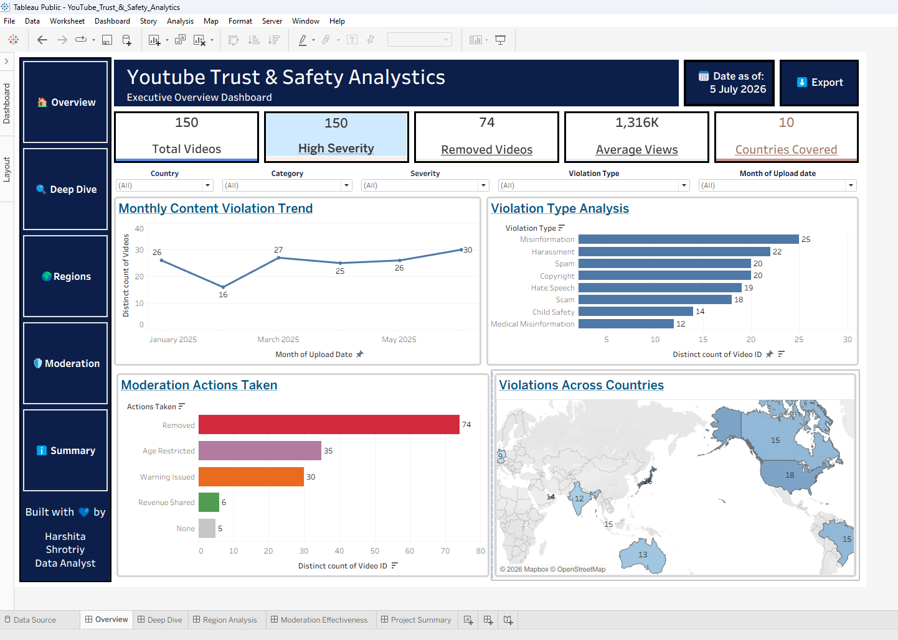

# 🎥 YouTube Trust & Safety Analytics Dashboard

## 📌 Project Overview

This project presents an end-to-end Trust & Safety Analytics solution built using SQL, MySQL Workbench, Tableau Desktop, Tableau Public, and Excel. It analyzes YouTube moderation data to uncover content trends, evaluate moderation effectiveness, identify high-risk regions, and provide actionable business insights through interactive dashboards.

---

## 🌐 Live Dashboard

**View the interactive dashboard on Tableau Public:**

🔗 https://public.tableau.com/app/profile/harshita.shrotriy/viz/YouTube_Trust__Safety_Analytics/Overview

---

## 🛠️ Tools & Technologies

- Tableau Desktop 2026
- Tableau Public
- SQL
- MySQL Workbench
- Microsoft Excel

---

# 📊 Dashboard Walkthrough

## 1️⃣ Executive Overview



---

## 2️⃣ Deep Dive Analysis


---

## 3️⃣ Country / Region Analysis


---

## 4️⃣ Moderation Effectiveness


---

## 5️⃣ Project Summary


---

# 💡 Key Insights

- High-severity violations account for most removed videos.
- Misinformation and Harassment are the most frequently reported violation categories.
- Japan, USA, and Brazil recorded the highest violation volumes.
- Content Removal is the most common moderation action.
- Moderation activity remained stable with a gradual increase toward the end of the reporting period.

---

# 📂 Repository Structure

```
dashboard/
│── Tableau Workbook (.twb)

data/
│── Sample Dataset (.csv)

sql/
│── SQL Analysis Queries

images/
│── Dashboard Screenshots
```

---

# 👩‍💻 Author

**Harshita Shrotriy**

Data Analyst | SQL | Tableau | Business Analytics | Trust & Safety Analytics
